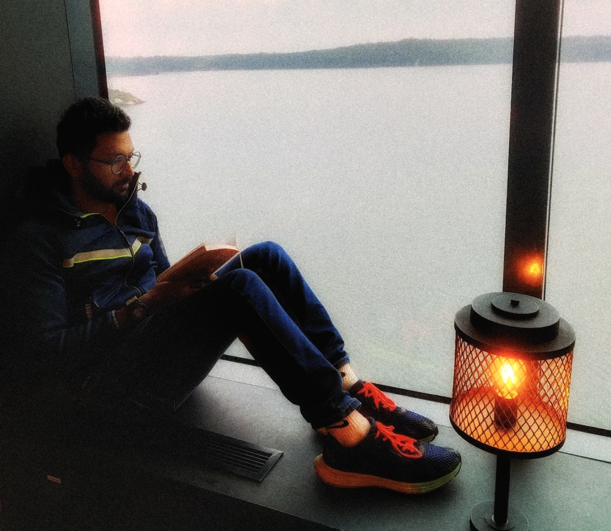
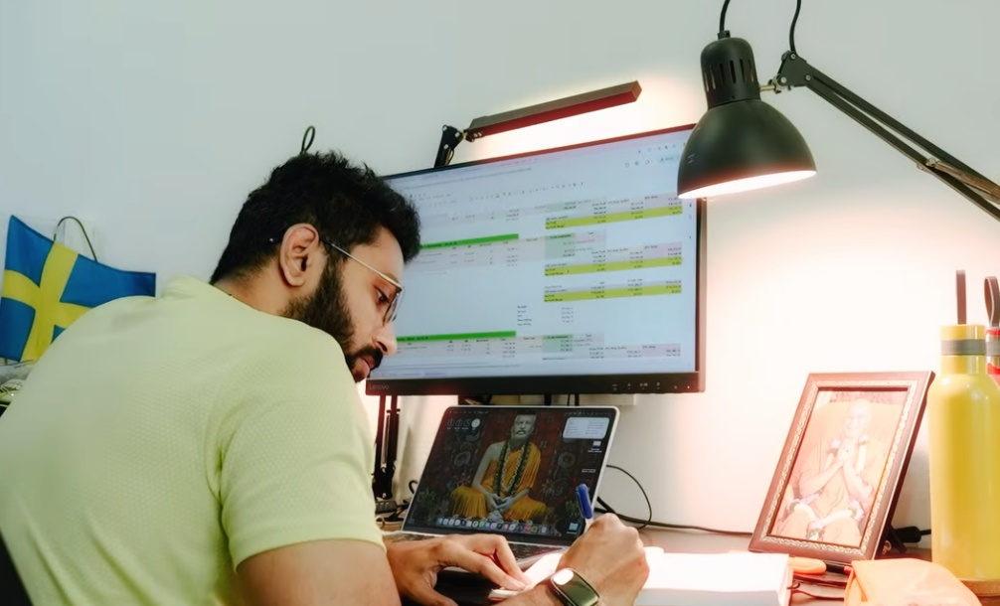
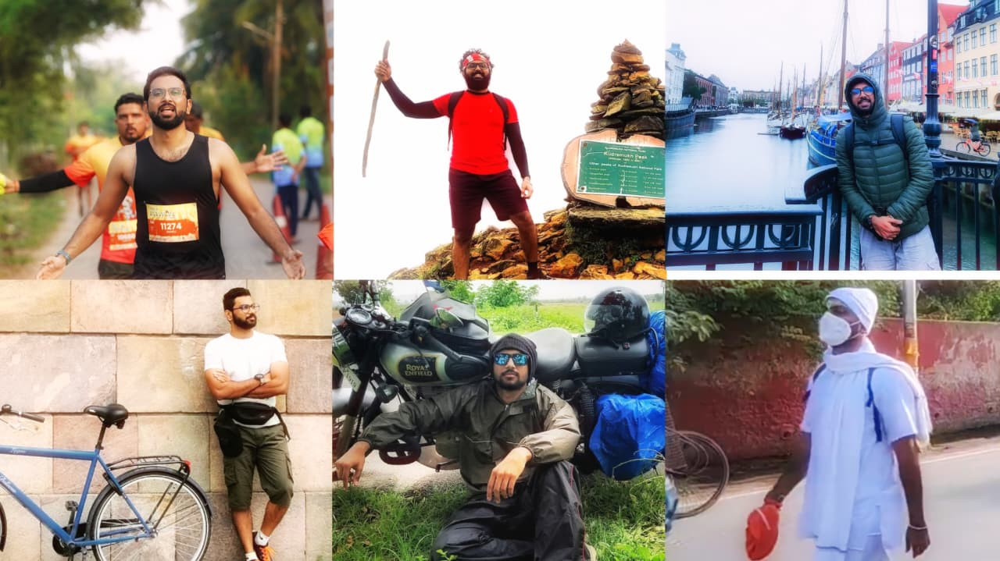

There's a question I keep coming back to. Who are you, and what are you? I don't have the full answer yet. But almost everything I've built has been a way of walking toward it. So let me tell you the story, and maybe you'll see what I mean.

## Where I started

I was born in Udupi, a small district in Karnataka. I grew up in Tamil Nadu and did all my schooling there. Then I moved to Manipal for my bachelor's degree, and to Bangalore for work.

Right after college, I worked in R&D for a US healthcare startup, based out of India. I spent my days with hardware, taking things apart and putting them back together. Bangalore was fun while it lasted.

## The first fall

In 2020, in the middle of the pandemic, I quit my job to start a company. It was my second time trying. My co-founders and I built Marble AI. We wanted to make the ultimate second brain for people who think for a living, something that turned their scattered notes into real knowledge. I was the CTO.

Here's a funny thing. I had learned to code in college, and I hated it. I avoided it for years. But my friend Prajwal sat with me and taught me again, patiently, until one day it clicked. Once I got deep into it, I loved it.

We ran Marble AI for almost three years. Then we shut it down.

We weren't wrong. We were early. AI was just starting to wake up, and we were standing a little too far ahead of the crowd, waving at a market that hadn't arrived yet. Being early feels exactly like being wrong. You can't tell the difference from the inside.

I won't pretend I handled it well. I was gutted. And instead of sitting with it, I did the thing restless people do. I jumped straight into the next thing, an AI startup in crypto. Three months in, I quit. The whole idea of crypto just never made sense to me, and I couldn't fake belief in something I didn't feel.

So now I had two failures back to back, and no idea what to do next. That was a dark stretch. Not dramatic, just heavy. The kind of low where you stop trusting your own judgment.

## The line that turned me around

Around then, I got a chance to hear Mr. Narayana Murthy speak in Hubli.

I went in tired. I came out changed.

He talked about his own early failure. When he first started out, with a company called Softronics, he found that customers in Pune had few computers and no real interest in software. So he shut it down and pivoted toward the export market. He didn't hide the failure. He just walked us through it plainly, as one step on the way to Infosys.

Then he said the thing I've never forgotten. 

> When a problem arrives, tell yourself that God has chosen you for this challenge. Have faith. Once you have faith, you're really saying: I don't have the solution, so I hand this over to the Almighty. And strangely, that act gives you the energy and the confidence to go and solve it yourself.

That rearranged something in me. I had been treating failure like proof that I wasn't good enough. He made me see it as a normal, even necessary, part of building anything worth building. Work hard. Work smart. Give it everything. And then have faith in something bigger than yourself. That was the deal.

I decided to stop forcing the next idea. I went to Europe to be with family and to let my head clear.

## The two books that changed the question

I backpacked across Europe with two books in my bag. One was "The Tatas: How a Family Built a Business and a Nation" by Girish Kuber. The other was Swami Vivekananda on Karma Yoga, given to me by a brother monk.

I read them side by side, city after city, train after train, bus after bus, across Sweden, Denmark, Germany, and more. And slowly the two books started talking to each other in my head. One was about a family that built a business and, through it, helped build a country. The other was about doing your work as a form of service, without clinging to what you get out of it.

By the time I came home, my question had changed. It was no longer "what should I build for myself." It was "what should I build that outlasts me."

The obvious answer was social work. But I watched friends in that world, and I saw the trap. Good people, real missions, and yet always waiting on someone rich to decide whether the money came this year or not. I didn't want to build something that lived on permission. I knew how to build tech products. So I decided to build a company, a real one that could stand on its own, but one where the country came first and the profit came second.

## The person who gave it a face

I still had no plan. I rented a tiny workspace near my home in Karkala, a small town, put my laptop on the desk, and waited for the idea to show up.

It showed up as a person.

She came by, looking for work. She had a master's degree in mathematics. Sharp. Capable. And she was ready to take a job in Bangalore for ten thousand rupees a month, doing work that had nothing to do with the years she'd spent studying. She wasn't defeated about it. That was the part that got me. She had simply accepted that this was as far as someone like her, from a place like ours, was supposed to go.

We talked for a while. What stayed with me was the sense that she believed this was all she deserved. Not meant for anything great, she seemed to think, just something to support the family for now. Then she moved on, the way people do.

I couldn't shake it. I kept thinking: an average person, given the right room and the right people, could sit beside minds from IISc, learn from founders in Silicon Valley, walk into a place like MIT. I know this because I was that average person, and luck put me in those rooms. She had the ability. She just never got the room.

That's the day the company stopped being an idea.

## What I'm building now

That's how [CogniMuse](https://www.cognimuse.com/) began.

We hire people from small towns, the tier 2 and tier 3 cities that the big companies fly over. Many are dropouts. Most are humble. All of them share one thing: they want to do something great, and no one has ever handed them the chance.

We don't just train them to be good workers. We teach them the whole set of skills it takes to lead, and then we build real products with them, products that can stand next to anything made in Bangalore or San Francisco. The whole point is to prove that world-class work can come out of a small town, made by people the world wrote off.

I took the role of CEO. After years as a CTO, this was a different planet, and I had to learn it from zero. I'm still learning it.

But this is the thing I was walking toward the whole time. Not a product. Not an exit. A way to give other people the room I was lucky enough to get.

## How I think, and where I go to think

I picked up reading late, around 2019, on the metro between Jayanagar and Jalahalli. A few pages a day, and then I was hooked.

I read by problem. Whatever I'm struggling with, I go find the book for it. I couldn't wake up early, so I read "The 5 AM Club," and then woke at 5 for almost a year. I was scared of leading my team, so I read "Leadership in Turbulent Times," and the fear loosened its grip. Operations were a mess, so I read Andy Grove's "High Output Management." I pick a problem, solve it, and the book has done its job.

I have close to 300 books now. But since I turned toward the spiritual side, my reading has narrowed to a few: "The Gospel of Sri Ramakrishna," and the Bhagavad Gita. I've come to believe these hold the answer to almost anything.

Outside of work, I watch far too many movies and series. I travel. I love talking to people and hearing how they see their lives. I sit with intellectuals to understand this life, and with monks to understand what might lie past it. I'm married to a doctor. I lift, I cycle on weekends, and I love the long, quiet suffering of endurance sports, trekking, and hiking.

Which brings me back to where I started. Who are you, and what are you. I still can't answer it. But I've noticed that the closer I get to building something for other people, the less the question weighs on me. Maybe that's a clue.

I made this site to share what I find, what life teaches me, and the questions I can't stop asking. I put the longer thoughts on YouTube, and the shorter ones on Instagram.

Come along if any of this sounds like your kind of road.

